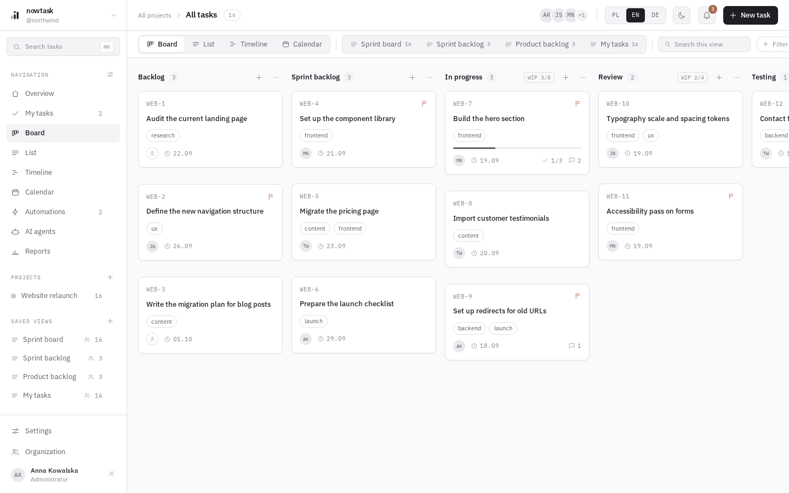
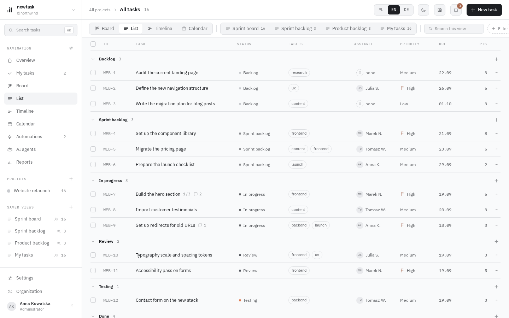
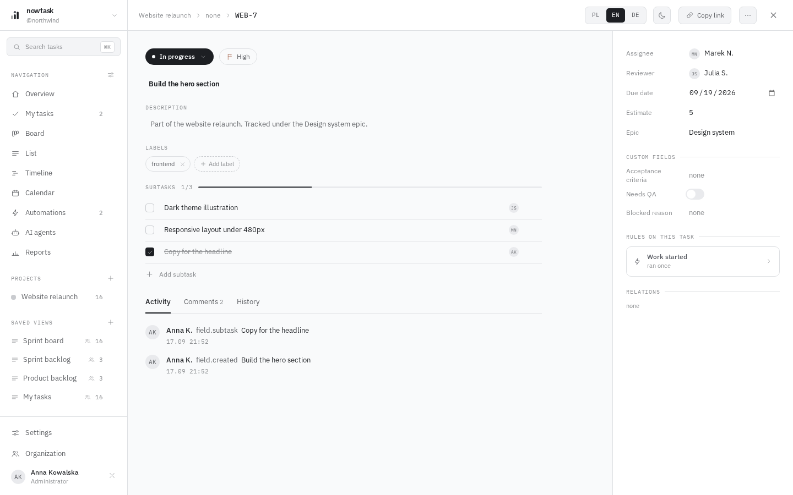
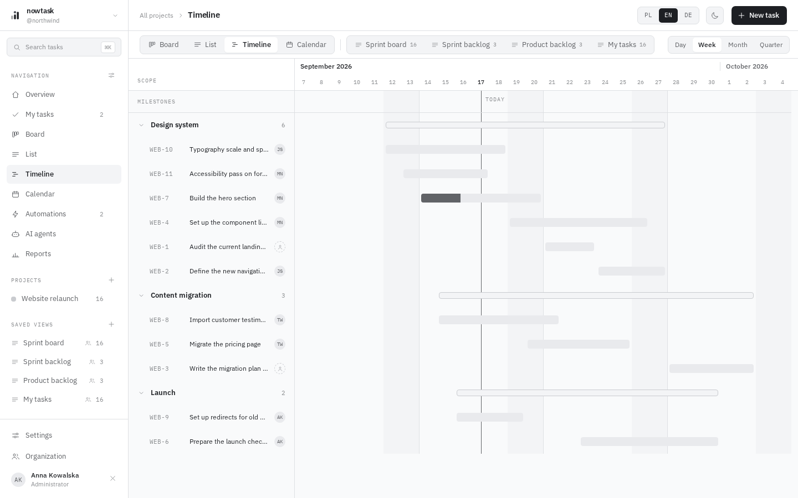
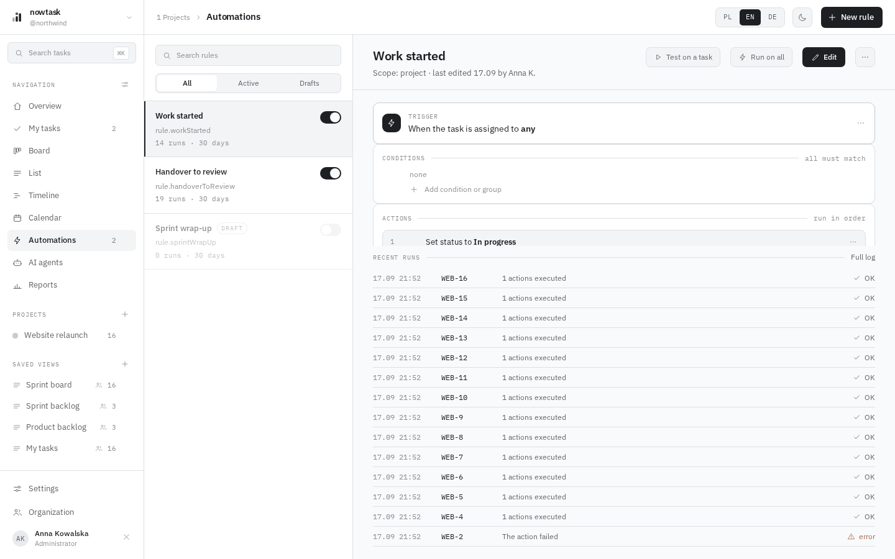
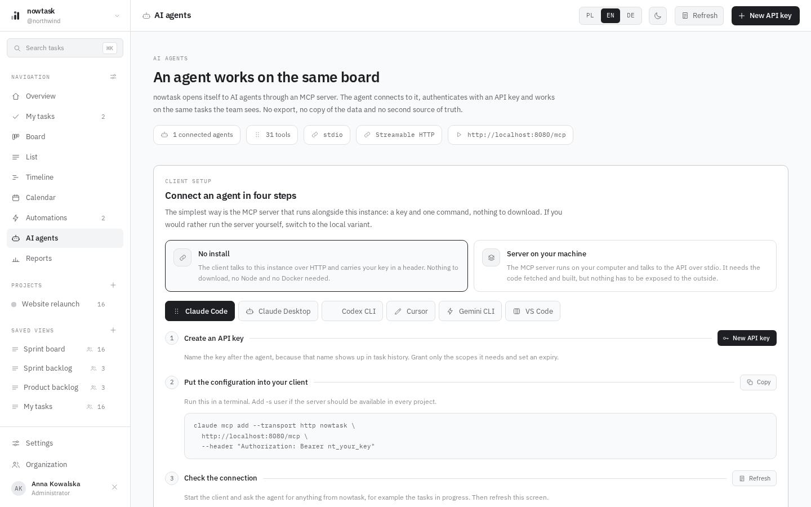
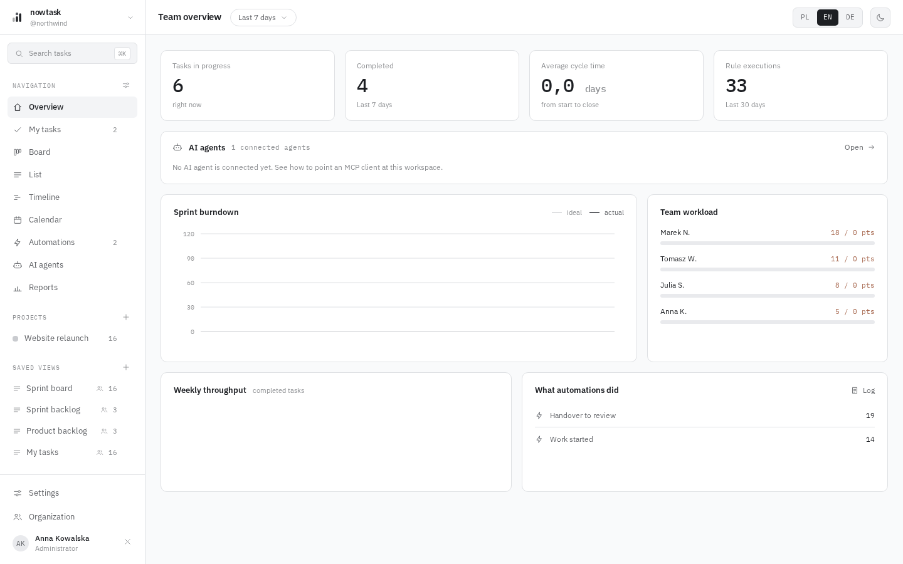
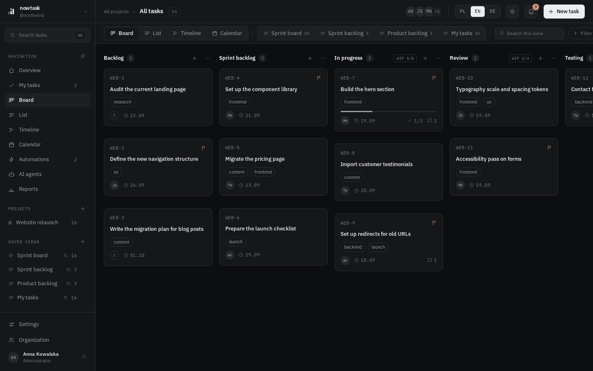

<picture>
  <source media="(prefers-color-scheme: dark)" srcset="brand/logo-horizontal-inverse.svg">
  
</picture>

**Now, not someday.**

[](https://github.com/arthurr0/nowtask.app/actions/workflows/ci-backend.yml)
[](https://github.com/arthurr0/nowtask.app/actions/workflows/ci-frontend.yml)
[](https://github.com/arthurr0/nowtask.app/actions/workflows/ci-mcp.yml)
[](https://github.com/arthurr0/nowtask.app/releases)
[](LICENSE)

nowtask is task management for teams: a board with statuses and fields that follow your
process, rules that move tasks, assign people and watch deadlines, and the same API in the
hands of your AI agents. One installation serves many organizations, every organization is
isolated in the database by row level security, and the interface speaks Polish, English and
German.

AI agents work here on equal terms with people. The repository ships an MCP server that gives an
agent 31 tools over the same API the interface uses, from searching and editing tasks through
comments and bulk operations to automation rules and metrics. An agent authenticates with an
API key that carries scopes, and every write it makes stays in the task history and in the
audit log under the key's name.

## Screenshots

| | |
|---|---|
|  |  |
| The board with the scrum preset, WIP limits per column | The list with grouping, filters and the saved views |
|  |  |
| A task with subtasks, custom fields, comments and the rules that touched it | The timeline, grouped by epic |
|  |  |
| A rule with its trigger, conditions, actions and run log | The AI agents screen that generates the client configuration |
|  |  |
| The team overview | The same board in the dark theme |

## What it does

- **Organizations**: many independent organizations in one installation, a person can belong
  to several, and PostgreSQL row level security keeps their data apart underneath the
  application, not only in it.
- **Roles and permissions**: administrator, manager, member and guest out of the box, custom
  roles composed from eighteen permissions, protected custom fields visible only with a
  permission, invitations with reminders, an audit log.
- **Projects and workflow**: statuses grouped into not started, in flight and done, allowed
  transitions with requirements, WIP limits, custom fields, labels, epics and sprints. New
  projects start from a scrum, kanban or waterfall preset.
- **Views**: board, list, timeline and calendar over the same data, saved views with nested
  filter groups shared across the team, a per-user default view, search and a command
  palette.
- **Automation**: rules with a trigger, nested conditions and ordered actions, tested on a
  task before they go live, with a run log that says what happened and why.
- **Notifications and integrations**: an in-app bell, mail over SMTP, webhooks signed with
  HMAC-SHA256 that format themselves for Slack and Discord, and a GitHub App that turns
  branches, pull requests, reviews, CI runs and releases into task activity and keeps issues
  in sync.
- **AI agents**: API keys with disjoint scopes, an MCP server over stdio or Streamable HTTP,
  and a screen that generates the configuration for Claude Code, Claude Desktop, Cursor,
  Codex CLI, Gemini CLI and VS Code.
- **Interface**: Angular 22 with signals and zoneless change detection, light and dark
  themes, five accents, density and radius settings, three languages, realtime updates over
  server-sent events, CSV and XLSX export.

## Status

nowtask is at 0.1.0, the first public release. The code is complete against the design
records in [docs/](docs/README.md) and the documentation describes what is actually
implemented, but the project is young and has not been through a long production life yet.

Verified on a local stack built from this repository: signup, invitations and organizations
with row level security, every view, presets and rules, the API key path and the MCP server
over HTTP with Claude Code, mail through Mailpit, and the container images from both compose
files. The backend tests cover the tenant schema, the webhook payloads for Slack and Discord,
the GitHub webhook signature and event handling, and every mail template in every language.

Not yet exercised against the live service, only against the protocol or the tests:

- Slack and Discord delivery. The payloads are tested, the deliveries are not.
- A real SMTP relay. Mailpit is what the test stack uses.
- The GitHub App against a live installation. Signatures and events are tested with recorded
  payloads.
- MCP clients other than Claude Code. The agents screen generates their configuration from
  their documentation.
- Corporate sign-in. `NOWTASK_SIGNUP_MODE=sso-only` is accepted and the interface shows the
  button, but there is no identity provider behind it yet.

If you run nowtask against one of those, an issue saying what worked or did not is the most
useful thing you can send.

## Quick start

Published images with Docker Compose:

```bash
git clone https://github.com/arthurr0/nowtask.app.git
cd nowtask.app
cp .env.example .env
docker compose -f docker-compose.prod.yml up -d
```

Set `NOWTASK_DB_PASSWORD`, `NOWTASK_APP_DB_PASSWORD` and `NOWTASK_APP_URL` in `.env` first;
compose refuses to start without the passwords. Then open <http://localhost:8080>, create
the first account at `/signup` and the wizard takes you through the organization and the
first project.

Everything from source, with Mailpit catching the mail at <http://localhost:8025>:

```bash
docker compose up --build
```

| Service | Address |
|---|---|
| Interface | <http://localhost:8080> |
| API | <http://localhost:8081/api/meta> |
| MCP server | <http://localhost:8080/mcp> |
| Mailpit | <http://localhost:8025> |
| PostgreSQL | `localhost:5433`, user and password `nowtask` |

The longer version, with the reverse proxy, the two database roles and backups, is in
[docs/install.md](docs/install.md).

## Your first rule in 60 seconds

1. **Board**: add a task to Sprint backlog and assign it to yourself. The preset rule "Work
   started" moves it to In progress, and **Automations** shows the run.
2. **Automations, New rule**: trigger "when a task is assigned", condition "priority is
   High", action "add the label urgent". Press **Test on a task** to see what it would do,
   then **Save**.
3. **Board**: assign a high priority task to someone. The label appears, the run log says why.
4. **AI agents, New key**: name it after the agent, keep the default read scopes, copy the
   generated `claude mcp add` command and run it.
5. Ask the agent what is in progress. The answer comes from the same board.

## Connecting an agent

The MCP server runs alongside the instance and nginx exposes it under `/mcp`, so an agent
needs neither the repository nor Node. The client brings the key in a header:

```bash
claude mcp add --transport http nowtask https://nowtask.example.com/mcp \
  --header "Authorization: Bearer nt_9f2c..."
```

Scopes are disjoint: `tasks:write` grants no right to delete, and `tasks:delete` has to be
granted on its own. They are checked by the API, not by the MCP server, so going around it
with a custom client gains nothing. Keys, scopes, every client and the trace an agent leaves
are in [docs/ai-agents.md](docs/ai-agents.md).

## Documentation

| | |
|---|---|
| [Install](docs/install.md) | Published images, building from source, running the parts on the host, reverse proxy, backups |
| [Configuration](docs/configuration.md) | Every environment variable, the database roles, mail, the GitHub App, security defaults |
| [Architecture](docs/architecture.md) | Backend modules, row level security, authentication, events and rules, the frontend, the MCP server |
| [AI agents](docs/ai-agents.md) | API keys, scopes, every MCP client, the tool list |
| [Integrations](docs/integrations.md) | In-app notifications, webhooks, Slack and Discord, mail, the GitHub App |
| [MCP server](mcp/README.md) | Running the server, its variables, error handling, troubleshooting |
| [API contract](docs/api-contract.md) | Every path and payload, binding for the backend and the frontend |
| [Release process](docs/release-process.md) | How a release is cut and verified |
| [Design records](docs/README.md#design-records) | Multi-tenancy, presets and onboarding as they were designed |

## Project layout

```text
backend/           Gradle multi-module Spring Boot 4.1 application on Java 25
  shared/          permissions, organization context, exceptions, events
  identity/        users, organizations, roles, sessions, API keys, audit log
  workspace/       projects, statuses, custom fields, labels, saved views, presets
  tasks/           tasks, subtasks, comments, relations, history, watchers
  automation/      rule engine and run log
  analytics/       dashboard metrics
  integrations/    notifications, webhooks, mail, the GitHub App
  realtime/        server-sent events
  exports/         CSV and XLSX
  app/             Spring configuration, security, migrations, entry point
frontend/          Angular 22, signals, zoneless, Tailwind 4
mcp/               the MCP server, TypeScript
docs/              the documentation this README links to
brand/             logo, favicon, palette
```

## Development

```bash
docker compose -f docker-compose.dev.yml up -d        # PostgreSQL 18 on port 5433
cd backend && ./gradlew :app:bootRun                   # http://localhost:8081
cd backend && ./gradlew build                          # compile and test, PostgreSQL from Testcontainers
cd frontend && pnpm install && pnpm start              # http://localhost:4200, proxies /api
cd frontend && pnpm exec prettier --check .            # the check CI runs
cd mcp && npm install && npm run typecheck && npm run build
```

Java 25, Node 24 with pnpm 11 for the frontend, Node 22 or newer for the MCP server, and
Docker or Podman for PostgreSQL and the backend tests.

## Contributing

Bug reports, ideas and pull requests are welcome. [CONTRIBUTING.md](CONTRIBUTING.md) covers
the development setup, the coding rules, the tests and what a pull request needs. Behaviour in
the project follows the [Code of Conduct](CODE_OF_CONDUCT.md).

Security problems do not belong in an issue. [SECURITY.md](SECURITY.md) explains how to report
one privately and what is in scope.

Releases are cut from tags, the process is in [docs/release-process.md](docs/release-process.md).

## License

Business Source License 1.1, full text in [LICENSE](LICENSE).

In short: the code is open, you can read it, change it and run it yourself. Production use is
free for up to 25 users in total. Above that threshold, and when offering nowtask to third
parties as a hosted service, a commercial license is required: <kontakt@nowtask.app>. Every
version switches to Apache 2.0 on 20 August 2029.

The official instance at <https://nowtask.app> is run by nowtask.
